# 🎮 Kuarahy Games Backlog

A personal backlog of games to play, organized alphabetically. Covers beat 'em ups, action RPGs, brawlers, and classics.

---

## Acts of Blood *(2026)*

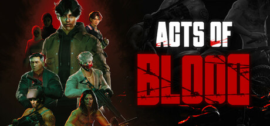

| | |
|:---|:---|
| **Genre** | Beat 'em Up · Action |
| **Developer** | Eksil Team |
| **Platform(s)** | PC |
| **Year** | TBA 2026 |
| **Status** | 🔜 Upcoming |
| **Players** | 1 player |

> Set in the dystopian Indonesian city of Bandapa, Acts of Blood follows Hendra, a college student who takes violent revenge after his family is murdered by a corrupt business rival. Fast-paced hand-to-hand combat, parkour, and weapon variety in a gritty urban brawler built in the Southeast Asian indie scene.

---

## Blazing Chrome

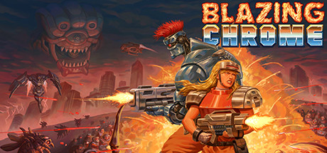

| | |
|:---|:---|
| **Genre** | Run and Gun |
| **Developer** | JoyMasher |
| **Platform(s)** | PC · PS4 · Switch · Xbox |
| **Year** | 2019 |
| **Status** | ✅ Available |
| **Players** | 1–2 players (local co-op) |

> A relentless love letter to classic Contra and Metal Slug, Blazing Chrome drops you into a post-apocalyptic war between humans and machines. Two playable characters, multiple weapon types, mechs, pixel-perfect art, and an outstanding chip-driven soundtrack. One of the best run-and-guns in years.

---

## Chroma Squad

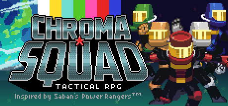

| | |
|:---|:---|
| **Genre** | Tactical RPG · Strategy |
| **Developer** | Behold Studios |
| **Platform(s)** | PC · PS4 · Xbox · Switch |
| **Year** | 2015 |
| **Status** | ✅ Available |
| **Players** | 1 player |

> You're a stuntman who quits their job to start an indie tokusatsu studio — think Power Rangers, but you run the whole show. Manage your studio, craft props and costumes, and fight monsters in turn-based tactical battles. Deeply charming, with tons of Super Sentai and anime references.

---

## Double Dragon Revive

| | |
|:---|:---|
| **Genre** | Beat 'em Up · Action |
| **Developer** | Yuke's |
| **Platform(s)** | PC · PS4/5 · Xbox |
| **Year** | 2025 |
| **Status** | ✅ Available |
| **Players** | 1–2 players (co-op) |

> Billy and Jimmy Lee return in this 3D action brawler, a modern revival of the legendary Double Dragon franchise. Revive blends classic side-scrolling beat 'em up sensibility with stylish 3D combat, new mechanics, and a modern presentation — while keeping the raw street brawl spirit intact.

---

## Fight'N Rage

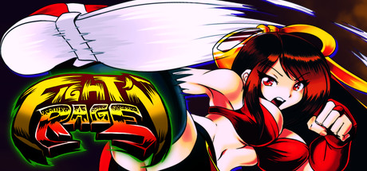

| | |
|:---|:---|
| **Genre** | Beat 'em Up |
| **Developer** | sebagamesdev (Sebastián García) |
| **Platform(s)** | PC · PS4 · Xbox · Switch |
| **Year** | 2017 |
| **Status** | ✅ Available |
| **Players** | 1–3 players (local co-op) |

> A solo-developed beat 'em up that nails the golden age of 90s arcade brawlers. Choose from three fighters in a dystopian future ruled by mutants, chain brutal combos, and navigate multiple branching paths and endings. Fluid, deeply refined gameplay — with unlock content that keeps on giving.

---

## Final Vendetta

| | |
|:---|:---|
| **Genre** | Beat 'em Up |
| **Developer** | Bitmap Bureau |
| **Platform(s)** | PC · PS4 · Xbox · Switch |
| **Year** | 2022 |
| **Status** | ✅ Available |
| **Players** | 1–3 players (local co-op) |

> A raw, no-nonsense beat 'em up clearly inspired by Streets of Rage 2 and Double Dragon. Set in a gritty London underworld, three fighters brawl through seven stages with a rock/electronic soundtrack by Featurecast. Tight combat, responsive controls, and a genuine arcade feel.

---

## First Berzerker: Khazan

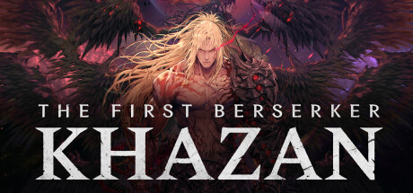

| | |
|:---|:---|
| **Genre** | Action RPG · Souls-like |
| **Developer** | Neople (Nexon) |
| **Platform(s)** | PC · PS5 · Xbox Series |
| **Year** | 2025 |
| **Status** | ✅ Available |
| **Players** | 1 player |

> Set in the Dungeon Fighter Online universe, Khazan is a brutal souls-like following a disgraced general seeking vengeance. Deeply punishing but rewarding melee combat, a rich dark-fantasy world with stylized 3D and ink-wash cel-shading, and genuinely tough boss encounters.

---

## He-Man and the Masters of the Universe™: Dragon Pearl of Destruction *(2026)*

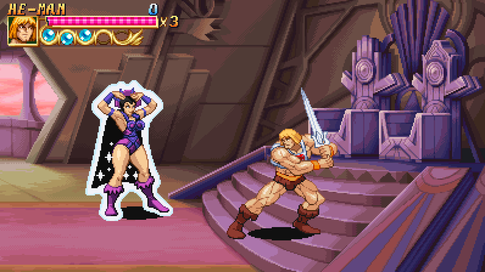

| | |
|:---|:---|
| **Genre** | Beat 'em Up · Arcade |
| **Developer** | Bitmap Bureau |
| **Publisher** | Limited Run Games |
| **Platform(s)** | PC · Consoles |
| **Year** | April 28, 2026 |
| **Status** | 🔜 Upcoming |
| **Players** | 1–3 players (local co-op) |

> Skeletor unearths the Dragon Pearl of Destruction and only He-Man, Man-At-Arms, and Teela can stop him. Developed by the retro specialists at Bitmap Bureau, this 2D arcade brawler features massive pixel-art sprites, Battle Cat riding sections, local co-op, and a lineup of classic Masters of the Universe villains.

---

## Jitsu Squad

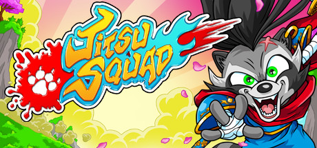

| | |
|:---|:---|
| **Genre** | Beat 'em Up |
| **Developer** | Tanuki Creative Studio |
| **Platform(s)** | PC · PS4 · Xbox · Switch |
| **Year** | 2022 |
| **Status** | ✅ Available |
| **Players** | 1–4 players (local co-op) |

> A vibrant anime-inspired brawler featuring four unique martial artist heroes on a mission to stop a magical artifact from corrupting the world. Smooth combo system, unlockable guest characters, and a colorful Saturday-morning-cartoon aesthetic with surprisingly deep mechanics.

---

## Legend of Mana *(PS1 / HD Remaster)*

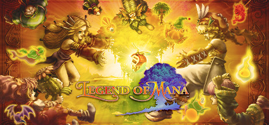

| | |
|:---|:---|
| **Genre** | Action RPG |
| **Developer** | Square (original) · Square Enix (remaster) |
| **Platform(s)** | PS1 (1999) · PC · PS4 · Switch (2021 remaster) |
| **Year** | 1999 / 2021 |
| **Status** | ✅ Available |
| **Players** | 1 player |

> The most experimental entry in the Mana series — a non-linear action RPG where you literally build the world by placing artifacts on a map. Gorgeous watercolor-inspired art, a sweeping orchestral score by Yoko Shimomura, and interconnected vignette-style stories. Meditative and unlike anything else.

---

## Midnight Fight Express

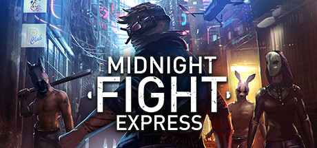

| | |
|:---|:---|
| **Genre** | Beat 'em Up · Brawler |
| **Developer** | Jacob Dzwinel |
| **Platform(s)** | PC · PS4 · Xbox · Switch |
| **Year** | 2022 |
| **Status** | ✅ Available |
| **Players** | 1 player |

> A solo-developed isometric brawler where you fight through an entire city in a single night. Think Absolver meets John Wick — fluid, physics-driven combat with contextual environmental takedowns, a deep upgrade tree, and a pounding electronic soundtrack. Surprisingly polished for a one-man project.

---

## Mother Russia Bleeds

| | |
|:---|:---|
| **Genre** | Beat 'em Up |
| **Developer** | Le Cartel Studio |
| **Platform(s)** | PC · PS4 |
| **Year** | 2016 |
| **Status** | ✅ Available |
| **Players** | 1–4 players (local co-op) |

> A brutally violent beat 'em up set in a seedy alternate Soviet Union. Four street fighters addicted to a mysterious drug fight through the criminal underworld in a story rife with dark themes. Inspired by Final Fight with heavy punk/industrial aesthetics, tons of blood, and up to 4-player local co-op.

---

## Orbitals *(2026)*

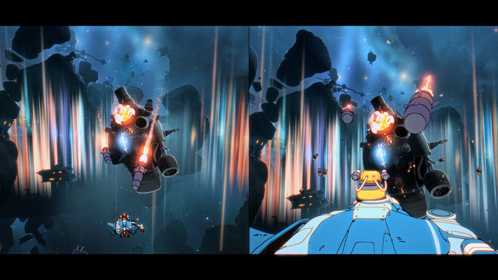

| | |
|:---|:---|
| **Genre** | Puzzle Adventure |
| **Developer** | Shapefarm KK |
| **Publisher** | Kepler Interactive |
| **Platform(s)** | Nintendo Switch 2 (exclusive) |
| **Year** | 2026 |
| **Status** | 📅 Upcoming |
| **Players** | 2 players (asymmetric co-op) |

> An intergalactic 2-player co-op adventure set in a retro anime world, built from the ground up for asymmetric play — local split-screen or online via Nintendo Switch 2 GameShare. Team up as Maki and Omura, two explorers navigating a supernatural cosmic storm to save their crumbling station home. Features hand-crafted cinematic cutscenes from Studio Massket, full Japanese and English voice acting, and an original retro-anime soundtrack. Nintendo Switch 2 exclusive.

---

## Pocky & Rocky Reshrined

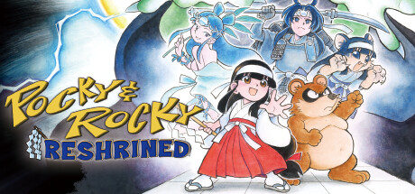

| | |
|:---|:---|
| **Genre** | Top-Down Shoot 'em Up · Action |
| **Developer** | Tengo Project (Taito / Square Enix) |
| **Platform(s)** | PC · PS4 · Switch |
| **Year** | 2022 (JP) / 2023 (Steam) |
| **Status** | ✅ Available |
| **Players** | 1–2 players (local co-op) |

> A revival of the classic SNES Kiki Kaikai series by the same team behind Shadow of the Ninja – Reborn. Follow shrine maiden Pocky and tanuki Rocky through colorful stages packed with yokai enemies, using shot and reflector attacks. Faithful to the original with updated visuals and new content.

---

## Ra Ra Boom

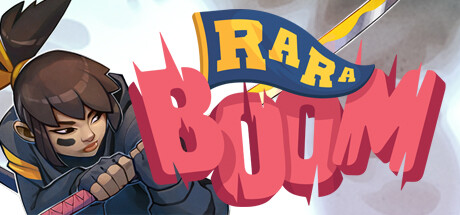

| | |
|:---|:---|
| **Genre** | Beat 'em Up · Co-op Brawler |
| **Developer** | Gylee Games |
| **Platform(s)** | PC |
| **Year** | 2025 |
| **Status** | ✅ Available |
| **Players** | 1–4 players (local co-op) |

> Four high schoolers from outer space defending Earth from rogue AI in a colorful 2.5D brawler. Designed around 4-player local co-op with a pick-up-and-play approach, upgrade systems, and retro arcade spirit wrapped in a modern, candy-colored presentation. Best enjoyed with friends.

---

## River City Girls 2

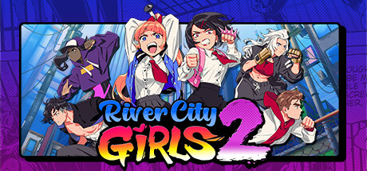

| | |
|:---|:---|
| **Genre** | Beat 'em Up |
| **Developer** | WayForward |
| **Platform(s)** | PC · PS4/5 · Xbox · Switch |
| **Year** | 2022 |
| **Status** | ✅ Available |
| **Players** | 1–2 players (co-op) |

> Misako, Kyoko, and a growing cast of playable characters return in this direct sequel to the acclaimed River City Girls. Bigger world, more fighters (including Double Dragon's Billy and Jimmy Lee), new moves, and the same sharp anime art style paired with a catchy J-pop/hip-hop soundtrack.

---

## RUINER *(Cyberpunk Twin-Stick)*

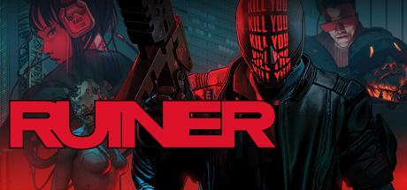

| | |
|:---|:---|
| **Genre** | Twin-Stick Shooter · Cyberpunk Action |
| **Developer** | Reikon Games |
| **Platform(s)** | PC · PS4 · Xbox |
| **Year** | 2017 |
| **Status** | ✅ Available |
| **Players** | 1 player |

> A neon-drenched, ultraviolent twin-stick shooter set in a dystopian cyberpunk future called RENGKOK. You're a masked killer on a murderous path to rescue your brother from a corporate megapower called HEAVEN. Brutal, stylish, and relentlessly fast, with top-tier art direction and a standout electronic soundtrack.

---

## Shadow of the Ninja: Reborn

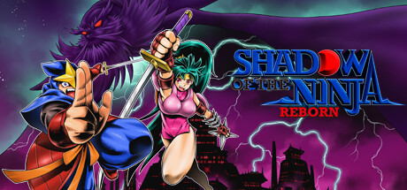

| | |
|:---|:---|
| **Genre** | Action Platformer |
| **Developer** | Tengo Project (Taito / Square Enix) |
| **Platform(s)** | PC · PS4 · Xbox · Switch |
| **Year** | 2024 |
| **Status** | ✅ Available |
| **Players** | 1–2 players (local co-op) |

> A gorgeous remake of the 1990 NES ninja game by the same team behind Pocky & Rocky Reshrined. Two ninja operatives battle through a futuristic dystopian Japan. Tight platforming, precise combat, a fantastic soundtrack, and stunning pixel art that elevates everything the original did right.

---

## Shinobi: Art of Vengeance

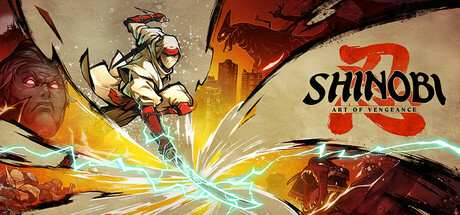

| | |
|:---|:---|
| **Genre** | Action Platformer |
| **Developer** | Lizardcube |
| **Publisher** | SEGA |
| **Platform(s)** | PC · PS4/5 · Xbox · Switch |
| **Year** | 2025 |
| **Status** | ✅ Available |
| **Players** | 1 player |

> A modern revival of SEGA's beloved ninja franchise, developed by Lizardcube (Wonder Boy) in partnership with SEGA. Joe Musashi returns in a fluid, combat-focused action platformer with hand-drawn animation, a dark supernatural story, and tight enemy encounters inspired by the classic 1987 original.

---

## Sifu

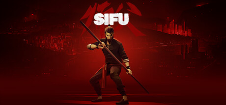

| | |
|:---|:---|
| **Genre** | Beat 'em Up · Martial Arts |
| **Developer** | Sloclap |
| **Platform(s)** | PC · PS4/5 · Xbox · Switch |
| **Year** | 2022 |
| **Status** | ✅ Available |
| **Players** | 1 player |

> You're a young kung fu student hunting down the assassins who killed your family — and every time you die, you age. A deeply skill-based brawler built around Pak Mei kung fu, Sifu demands patience, adaptability, and mastery. Stylish, brutal, and wholly original — with one of the best combat feels in modern gaming.

---

## The Takeover

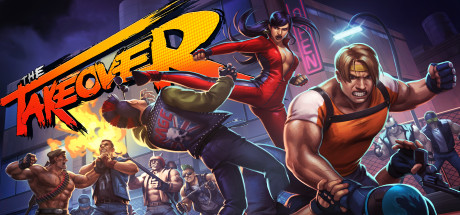

| | |
|:---|:---|
| **Genre** | Beat 'em Up |
| **Developer** | Pelikan13 |
| **Platform(s)** | PC · PS4 · Xbox · Switch |
| **Year** | 2019 |
| **Status** | ✅ Available |
| **Players** | 1–3 players (local co-op) |

> A polished modern beat 'em up with Streets of Rage DNA — three fighters clean up a crime-ridden city using combos, throws, and weapons. Beautifully executed HD sprites, a pounding electronic soundtrack (including Yuzo Koshiro contributions), and solid 3-player local co-op. Built by genuine fans of the genre.

---

## Tower of Druaga *(1984)*

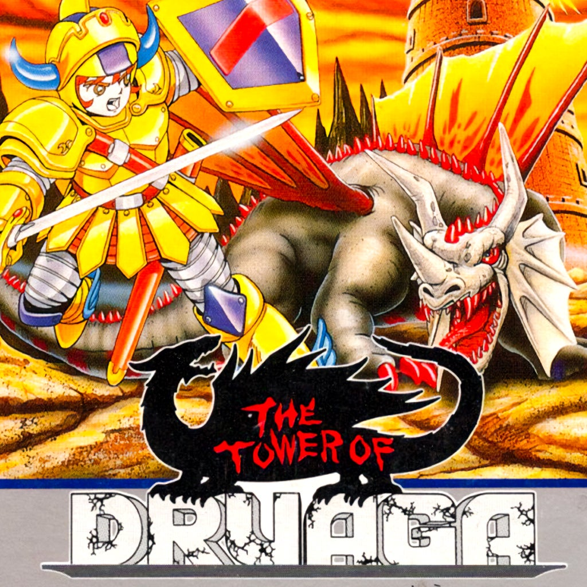

| | |
|:---|:---|
| **Genre** | Maze Action · Dungeon Crawler |
| **Developer** | Namco (Masanobu Endo) |
| **Platform(s)** | Arcade (1984) · Various ports |
| **Year** | 1984 |
| **Status** | 🕹️ Classic |
| **Players** | 1 player |

> One of the earliest action-RPG dungeon crawlers, Tower of Druaga spawned an entire genre. Player Gil climbs 60 floors of a tower, each containing a hidden treasure chest uncovered through cryptic actions — shooting, walking specific patterns, killing enemies in order. A puzzle-riddled proto-RPG that defined an era of Japanese game design.

---

## Valkyrie Profile *(PS1)*

| | |
|:---|:---|
| **Genre** | Action RPG · Turn-Based |
| **Developer** | tri-Ace |
| **Publisher** | Enix |
| **Platform(s)** | PS1 (1999) · PSP (2006) |
| **Year** | 1999 |
| **Status** | 🕹️ Classic |
| **Players** | 1 player |

> Lenneth Valkyrie collects the souls of slain warriors to send to Odin's army in preparation for Ragnarok. A hauntingly beautiful RPG that blends side-scrolling action platforming with side-view turn-based combat. Celebrated for its operatic story, dark Norse mythology, and tri-Ace's signature fast-paced battle system. A PS1 hidden gem.

---

*Last updated: April 2026*
